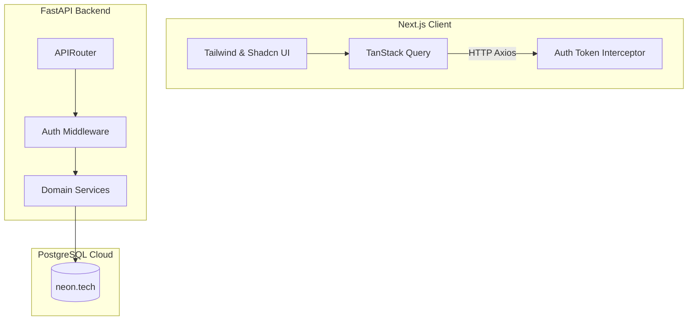
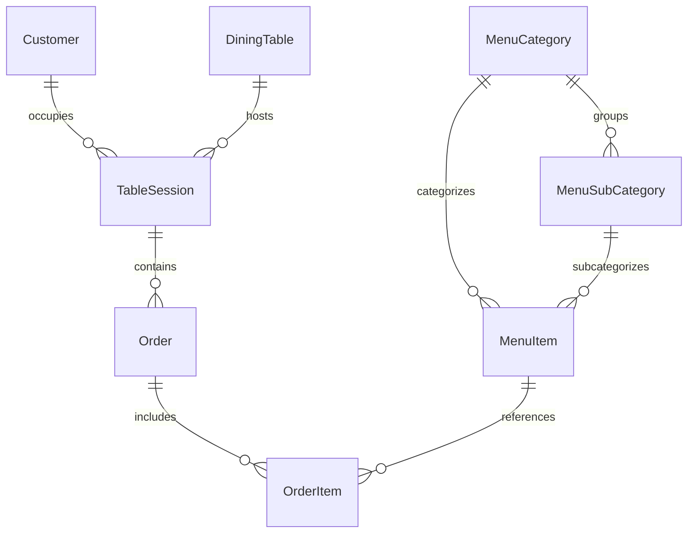

# 🍽️ NJ's Café & Restaurant — Service Management System

[](https://fastapi.tiangolo.com/)
[](https://nextjs.org/)
[](https://www.postgresql.org/)
[](https://sqlmodel.tiangolo.com/)
[](https://tailwindcss.com/)

A production-ready, full-stack service management system designed to handle day-to-day operations for restaurants and cafés. 

* **Real-World Origins**: Built from a real brief provided by a hospitality manager. This system was designed to address practical problems in table workflow, order snapshotted states, and staff-customer lifecycles.

---

## 🏗️ System Architecture



---

## 📊 Database Entity Relationship Model



---

## 🛠️ Tech Stack

### Backend
* **Framework**: FastAPI (Asynchronous REST API)
* **ORM**: SQLModel (Bridges SQLAlchemy and Pydantic)
* **Database**: PostgreSQL (hosted on [Neon](https://neon.tech))
* **Migrations**: Alembic
* **Auth**: JWT (JSON Web Tokens) with Role-Based Access Control (RBAC)
* **Runtime**: Python 3.12+ (Package management via `uv`)

### Frontend
* **Framework**: Next.js 16 (App Router, Client Components)
* **State Management**: TanStack Query (React Query)
* **Styling**: Tailwind CSS v4 + Radix UI / Shadcn UI components
* **HTTP Client**: Axios with automatic request interception

---

## ✨ Architectural Design Decisions

* **Price Snapshotting**: When an item is added to an order, the current menu price is copied to the `price_at_time` field of `OrderItem`. This ensures that future updates to menu item prices do not retrospectively corrupt historical order totals or restaurant financial records.
* **State Freezing**: When an order is marked `served` or a session is `closed`, the final monetary sums are frozen and stored in `final_total` and `final_bill`. Live recalculation is suspended for finalized records to maintain database audit integrity.
* **Staff Access Guard**: Custom role dependencies enforce strict Separation of Duties. Standard operational routes are accessible by any authenticated `employee`, while management controls (menu CRUD, user management) are isolated behind `/admin` endpoints protected by `require_admin`.
* **Smart Item Merging**: Adding duplicate items (same item ID and custom preparation notes) to the same active order increments the existing record's `quantity` rather than creating redundant database rows.

---

## 📂 Project Structure

```
.
├── backend/
│   ├── app.py                  # FastAPI app & Lifespan Entry point
│   ├── routers.py              # Central router registration
│   ├── database.py             # DB engine & session generators
│   ├── base.py                 # SQLModel metadata registration
│   ├── alembic/                # DB migrations
│   ├── auth/                   # JWT & OAuth2 authorization
│   ├── user/                   # User accounts & roles
│   ├── customer/               # Customer spend & visit tracking
│   ├── menu/                   # Menu items, categories & subcategories
│   └── service_flow/           # Core Operations (dining tables, orders, order items)
│
└── frontend/
    └── app/
        ├── app/                # Next.js pages & layouts
        ├── components/         # Reusable UI & Domain components
        ├── lib/                # Axios instance with auth interceptors
        ├── providers/          # React Query & Auth context gates
        └── hooks/              # Custom React hooks
```

---

## 🚀 Getting Started

### Prerequisites
* Python 3.12+ (with [`uv`](https://github.com/astral-sh/uv))
* Node.js 18+
* PostgreSQL database connection string (local or cloud-hosted)

---

### Backend Setup

1. Navigate to the backend folder:
   ```bash
   cd backend
   ```
2. Install dependencies using `uv`:
   ```bash
   uv sync
   ```
3. Set up environment variables:
   ```bash
   cp .env.example .env
   ```
   *Edit `.env` and fill in your `DATABASE_URL` and `JWT_SECRET_KEY`.*
4. Run migrations:
   ```bash
   uv run alembic upgrade head
   ```
5. Start the development server:
   ```bash
   uv run fastapi dev app.py
   ```
The Swagger UI API documentation will be interactive at: `http://localhost:8000/docs`

---

### Frontend Setup

1. Navigate to the frontend folder:
   ```bash
   cd frontend/app
   ```
2. Install dependencies:
   ```bash
   npm install
   ```
3. Set up environment variables:
   ```bash
   cp .env.example .env.local
   ```
   *Verify that `NEXT_PUBLIC_BACKEND_URL` points to `http://localhost:8000`.*
4. Start the Next.js development server:
   ```bash
   npm run dev
   ```
The client dashboard will be available at: `http://localhost:3000`
